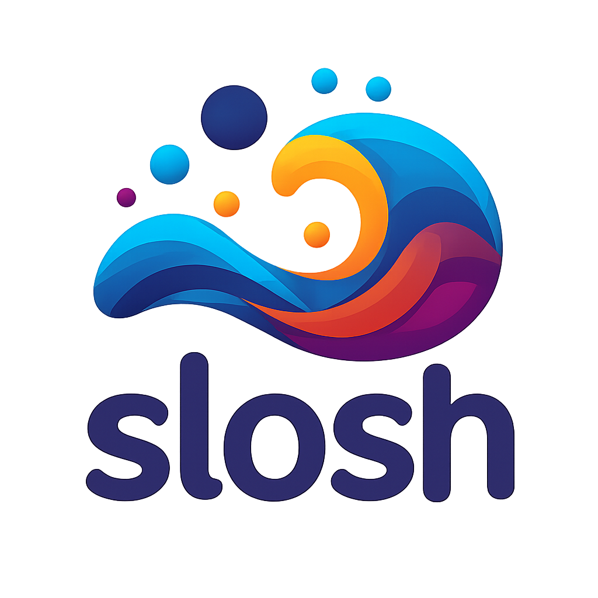

  

    

# Slosh: cross-platform MPM GPU physics simulation
## Running the examples

1. Download the Slang compiler libraries for your platform: https://github.com/shader-slang/slang/releases/tag/v2025.16
2. Unzip the downloaded directory, and use its path as value to the `SLANG_DIR` environment variable: `SLANG_DIR=/path/to/slang`.
   Note that the variable must point to the root of the slang installation (i.e. the directory that contains `bin` and `lib`).
3. For the 2D examples, run `cargo run --release --example testbed2`
4. For the 3D examples, run `cargo run --release --example testbed3`

## Notable MPM use-cases

This gives some insights of some interesting usages of MPM (the Material Point Method) for deformable physics
simulation. Note that it doesn’t imply that **slosh** currently implements these models:
- Animation: one very well-known usage of MPM is
  [snow simulation](https://www.disneyanimation.com/publications/a-material-point-method-for-snow-simulation/) by Pixar.
- Engineering: blast movement simulation ([patented](https://patents.google.com/patent/WO2025136223A1)).